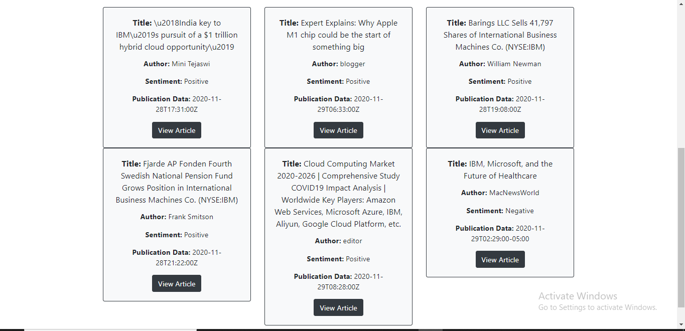
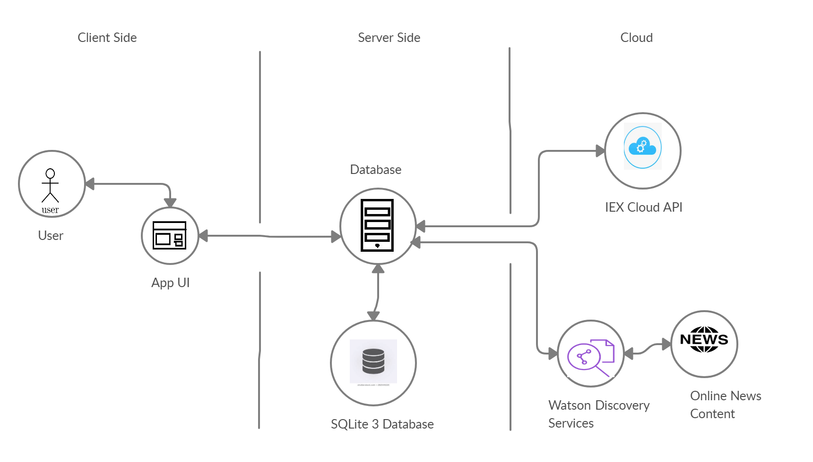

# Spondulator - The Financial Education System

*Spondulator* is a **stock market learning tool** designed and developed to help people make better financial decisions in life. By using this application, the users will not only be able to make the better financial decisions in life but will also gain the confidence to invest in the real-world stock market game and win the same.

## Description:

 *Spondulator* provides a better way to learn the stock market by experiencing the same in the virtual environment, which seems to be intimidating to do so in the real world with the help of real money. The system gives some initial amount of virtual money to the users to play with, using which they can look up for the stock data, buy the stock, as well as sell it. The application also shows the calculated profit or loss on the total committed money. The IBM Watson Cloud technology is used to perform sentiment analysis about any company from different news sources which is then classified into positive, negative or neutral category in order to make an informed decision. This can also help to make an investment decision around the company’s future value.
 
## Sentiment Breakdown for any Company Output:

As we know that, along with the normal metrics such as price and earnings, there are other factors that one should keep in mind in order to make an informed decision, factors such as sentiments about a company. Thus, users can go to the company route in order to get the insights about any company before buying the stock. 

## System Architecture:

The system provides a simple Web UI via which users can manage the portfolios of stocks. After collecting the User input, the system processes the data which is then routed to the backend server. Thereafter on the server side, the backend server stores then stock information in a SQLite3 database for easy retrieval. The backend server uses Watson Discovery service to find the information about a specific company, which then queries the Watson News collection for articles related to the company. The IEX Cloud API is also queried by the server to find the actual stock price in real time for a given company. Lastly, the news and sentiment of any company, as well as stock price are all returned and rendered in the web app to the user.

## Configuration and Running:

Steps to create new Django Project and new app inside it:
1. django-admin startproject PROJECT_NAME
2. cd PROJECT_NAME
3. python manage.py startapp APP_NAME
4. Add the APP_NAME in settings.py in list of INSTALLED_APPS
5. Register urls in project level urls.py (default one), as well as in app level urls.py after creating the urls.py in your app.

After cloning the spondular in your pc, remove db.sqlite3, pycache, and migrations folder as well from all sub folders of django project.

NOTE: Name of our django project is finance and the app inside it is spondulator.
Once removing above files, run the following commands in your terminal:
1. python manage.py makemigrations spondulator
2. python manage.py migrate
3. python manage.py runserver

NOTE: You can visit to "/admin" app to see the models i.e. tables in our database and modify the same from the admin panel only which is a Django default app.

## Specifications: 

This website complies with all the requirements of the **Advanced Software Engineering Final Project**.

1. Spondulator is a **distributed system** which uses the *third party API* from the *IEX cloud* to fetch real-time stock value, as well as the *IBM Watson Discovery service* is used to get the latest news about any company and perform sentiment analysis on the same. 
1. We have used  **Git** for Software Version Control. 
1. We have used **Trello** as a software project management system.
1. A dedicated testing strategy is used such as **Unit testing** as well as **Regression testing method**.
1. **System documentation** is available on Github as well as shared Google Doc link is provided in the presentation and report.
1. We have used **IBM Watson discovery pre-enriched open dataset.**

## Summary: 

The software is developed using **Agile Methodology** i.e. using both iterative as well as incremental fashion. In each iteration, our team gathered the necessary requirements and analyzed the same, followed by design, implementation as well as testing of the system in each phase. The software is created using the **Design Patterns** taught in the class such as **Gang of Four (GOF)** and **Grasp**, and thus it ensures the extensibility, maintanability as well  as the reusability of the software. We have also done the **Code Refactoring** in order to improve the overall design of the system while preserving its functionality. For instance, the code for the API's call that was written repeatatively, is now seprated and written in the different file i.e. helpers.py. 

## Development Tools:

* Languages: HTML 5, CSS 3, Python

* Library: Bootstrap 4

* Framework: Django

* API's: IBM Watson Discovery service, IEX Cloud API

* Tools: Trello, Visual Studio Code, Git

